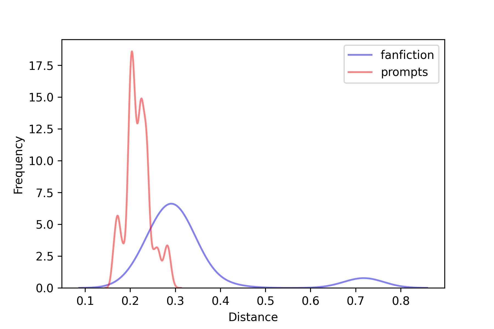

<!--more-->

## Goal of the Experiment
In this experiment we try to see if we can detect chatGPT written text on a topic using LPA.

We ran 200 on pok_mon where:

We have taken **6345** stories written by 5468 different writers on pok_mon.

We also took all the chatGPT along side with the stories and tested to see whether the Distance from the DVR is significantly different.

## Results

### Distances
The average distance of the real fanfiction from the DVR is: **0.33**
The average distance of the poromts fanfiction from the DVR is: **0.22**
The median distance of the real fanfiction from the DVR is: **0.30**
The median distance of the poromts fanfiction from the DVR is: **0.22**
After running a t-test we we arrived at this conclusion at 95% certainty:
**There is a significant difference between the distances of the real and prompt datasets, and the mean distance of the real dataset is not smaller than that of the prompt dataset.**

## F1
Our **average** f1 result was **0.99 **
Our **top** f1 result was **1.00 **
Our **worst** f1 result was **0.98**
Our **median** f1 result was **1.00**

## Threshold
Our **average** Threshold was **0.34 **
Our **highest** Threshold was **0.73 **
Our **lowest** Threshold was **0.28**
Our **median** Threshold was **0.30**

## Frequency
Our **average** frequency was **0.99 **
Our **highest** frequency was **1.00 **
Our **lowest** frequency was **0.97**
Our **median** frequency was **1.00**

## Recall
Our **average** recall was **1.00 **
Our **highest** recall was **1.00 **
Our **lowest** recall was **1.00**
Our **median** recall was **1.00**

